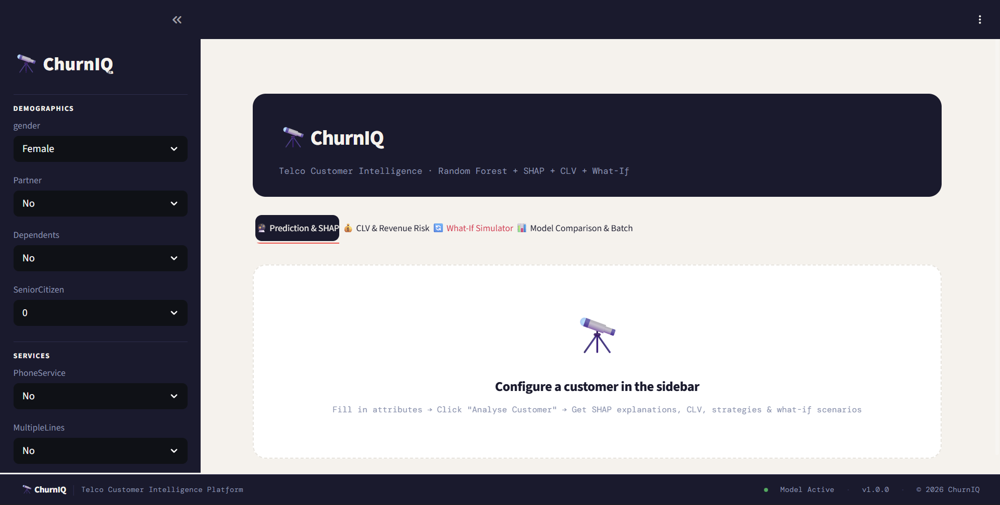

# 🔭 ChurnIQ — Telco Customer Churn Prediction

> End-to-end ML system to predict, explain, and act on customer churn using Random Forest, SHAP Explainable AI, CLV analysis, and a Streamlit dashboard.

---

## 🖥️ Dashboard Preview



*The ChurnIQ interface — real-time churn prediction, SHAP explanations, CLV analysis, and What-If simulations in one place.*

---

## ✨ Key Features

| Feature | Description |
|---|---|
| 🤖 **Multi-Model Training** | Random Forest (Optuna-tuned), Gradient Boosting, and Logistic Regression trained and compared automatically |
| 🧠 **Explainable AI (XAI)** | SHAP bar charts, feature impact tables, and per-prediction explanations — not just *what*, but *why* |
| 💰 **CLV & Revenue Risk** | Estimates Customer Lifetime Value, revenue at risk, and retention ROI per customer |
| 🔄 **What-If Simulator** | Re-scores 7 intervention scenarios instantly (e.g. "switch to 2-year contract") |
| 📊 **Batch Prediction** | Upload a CSV to score hundreds of customers at once with downloadable results |
| ⚖️ **Threshold Optimisation** | F1-optimal classification threshold via sweep — prioritises recall on the minority churn class |
| 🔁 **SMOTE Balancing** | Synthetic oversampling applied only to training data to handle the 73/27 class imbalance |

---

## 🧠 Explainable AI — SHAP Integration

ChurnIQ uses **SHAP (SHapley Additive exPlanations)** to make every prediction fully interpretable. This is critical for business trust — a churn score alone isn't actionable; knowing *why* a customer is at risk is.

### How It Works

SHAP assigns each feature a contribution value (positive = pushes toward churn, negative = pushes toward retention) based on Shapley values from cooperative game theory.

### Explainer Selection (Auto-Detected by Model Type)

| Model | SHAP Explainer Used | Why |
|---|---|---|
| Logistic Regression | `LinearExplainer` | Exact, fast — leverages linear structure |
| Random Forest | `TreeExplainer` | Exact, leverages tree paths directly |
| Gradient Boosting | `TreeExplainer` | Same — compatible with boosted trees |
| Any other model | `KernelExplainer` | Model-agnostic fallback (slower) |

The app auto-detects the winning model type and selects the correct explainer — no manual config needed.

### What You See in the Dashboard

- **SHAP Bar Chart** — Top 12 features ranked by absolute impact, coloured red (increases churn) or blue (reduces churn)
- **Feature Impact Table** — Full ranked table with SHAP values and direction arrows (↑ / ↓) for every encoded feature
- **Retention Strategies** — Generated from the top-5 SHAP features, so recommendations are grounded in the actual drivers of *this* customer's risk

### Example Interpretation

```
tenure              ████████████░░░░  −0.18   ↓ Reduces Churn   (long-tenured = loyal)
Contract_Month      ░░░░░████████████  +0.21   ↑ Increases Churn (no commitment)
TechSupport_No      ░░░░░░░████████░░  +0.14   ↑ Increases Churn (unresolved issues)
MonthlyCharges      ░░░░░░░░░████████  +0.11   ↑ Increases Churn (high cost sensitivity)
```

> **Background Note:** `LinearExplainer` uses a zero-vector background distribution to compute SHAP values for single-row inference — this gives each feature a proper baseline to compare against and avoids the zero-variance collapse that occurs when passing the input row as its own background.

---

## 📁 Project Structure

```
telco-churn-prediction/
├── data/
│   └── WA_Fn-UseC_-Telco-Customer-Churn.csv
├── demo/
│   └── dash.jpeg                  # Dashboard screenshot
├── evaluations/                   # Model evaluation plots (ROC, PR, F1, confusion matrix, distribution)
├── models/                        # Auto-generated after training
│   ├── best_model.pkl
│   ├── preprocessor.pkl
│   ├── feature_names.pkl
│   ├── column_info.pkl
│   ├── model_comparison.pkl
│   ├── raw_columns.pkl
│   └── meta.pkl
├── src/
│   ├── __init__.py                # Enables module imports across the project
│   ├── preprocess.py              # Cleaning, OHE, scaling
│   ├── train.py                   # SMOTE + Optuna + model comparison
│   ├── clv.py                     # Customer Lifetime Value logic
│   ├── evaluates.py               # Model evaluation script
│   └── retention.py               # Retention strategy recommender
├── .gitignore
├── Dockerfile
├── app.py                         # Streamlit dashboard (4 tabs)
├── info.py                        # Requirements check script
├── requirements.txt
└── README.md
```

---

## 📊 Dataset

| Property | Value |
|---|---|
| Source | IBM / [Kaggle](https://www.kaggle.com/datasets/blastchar/telco-customer-churn) |
| Rows | 7,043 customers |
| Features | 19 input columns + 1 target (`Churn`) |
| Class Split | ~73.5% No Churn / ~26.5% Churn |
| Known Issue | `TotalCharges` stored as string — 11 rows contain whitespace instead of a number |

**Feature Groups:**
- **Demographics** — gender, SeniorCitizen, Partner, Dependents
- **Services** — PhoneService, MultipleLines, InternetService, OnlineSecurity, OnlineBackup, DeviceProtection, TechSupport, StreamingTV, StreamingMovies
- **Billing** — Contract, PaperlessBilling, PaymentMethod
- **Numeric** — tenure, MonthlyCharges, TotalCharges

---

## ⚙️ Data Processing (`src/preprocess.py`)

1. **Load** raw CSV with `pandas.read_csv()`
2. **Coerce** `TotalCharges` to numeric — 11 whitespace rows become `NaN` and are dropped
3. **Drop** `customerID` (no predictive value) and map `Churn` → `0/1`
4. **Clip outliers** on numeric columns using IQR method (Q1 − 1.5×IQR to Q3 + 1.5×IQR)
5. **Encode** categoricals with `OneHotEncoder` (not `LabelEncoder` — avoids false ordinal ranking)
6. **Scale** numerics with `StandardScaler` via `ColumnTransformer`
7. **Passthrough** `SeniorCitizen` as-is (already 0/1)

The fitted `ColumnTransformer` is saved to `models/preprocessor.pkl` and reused at inference — ensuring identical encoding every time.

---

## 🤖 Model Training (`src/train.py`)

### Imbalance Handling
SMOTE (Synthetic Minority Oversampling) is applied **only to the training set** after the 80/20 stratified split, balancing the churn class from ~26% to 50% without touching test data.

### Hyperparameter Tuning
**Optuna** runs 30 trials of Bayesian optimisation, each scored by 5-fold stratified CV (ROC-AUC). Tuned parameters: `n_estimators`, `max_depth`, `min_samples_split`, `min_samples_leaf`, `max_features`.

### Model Comparison
Three models are trained and compared on the same SMOTE-balanced data:

| Model | Strength |
|---|---|
| Random Forest (Optuna-tuned) | Robust, handles mixed types, SHAP-compatible |
| Gradient Boosting | Often highest accuracy |
| Logistic Regression | Fast, linear baseline |

The best model by **Test AUC** is auto-selected and saved.

### Threshold Optimisation
Default 0.5 threshold is swept from 0.2→0.8 to find the value that maximises **F1 score** — prioritising recall on the minority churn class over raw accuracy.

---

## 🖥️ Streamlit App (`app.py`)

Run with: `streamlit run app.py` → opens at **http://localhost:8501**

| Tab | What It Shows |
|---|---|
| 🔮 Prediction & SHAP | Churn verdict, confidence, risk badge, SHAP bar chart explaining *why*, feature impact table, retention strategy cards |
| 💰 CLV & Revenue Risk | Estimated customer lifetime value, revenue at risk, retention ROI, customer tier (Bronze→Platinum) |
| 🔄 What-If Simulator | Re-scores 7 scenarios (e.g. "switch to 2-year contract") to show churn probability change |
| 📊 Model Comparison & Batch | AUC/F1 comparison chart + CSV upload for bulk scoring with download |

---

## 🚀 Setup & Installation

### 1. Clone the Repository

```bash
git clone https://github.com/nabakrishna/telco-churn-prediction.git
cd telco-churn-prediction
```

### 2. Create a Virtual Environment

```bash
python -m venv venv

# Activate on macOS/Linux
source venv/bin/activate

# Activate on Windows
venv\Scripts\activate
```

### 3. Install Dependencies

```bash
pip install -r requirements.txt
```

### 4. Add the Dataset

Download the CSV from [Kaggle — Telco Customer Churn](https://www.kaggle.com/datasets/blastchar/telco-customer-churn) and place it at:

```
data/WA_Fn-UseC_-Telco-Customer-Churn.csv
```

---

## 🏋️ Training the Model

Run the training script from the project root:

```bash
python src/train.py
```

Training takes approximately **3–5 minutes**. The console will print:

- SMOTE class counts before and after balancing
- Optuna trial progress (30 trials)
- Model comparison table (AUC + F1 for all 3 models)
- Optimal classification threshold
- Final classification report (precision, recall, F1 per class)

After training, the `models/` folder will be populated with 7 artifact files ready for the app.

---

## ▶️ Running the App

After training, launch the app from the project root:

```bash
streamlit run app.py
```

The app will open in your browser at `http://localhost:8501`.

> If port 8501 is busy, use: `streamlit run app.py --server.port 8502`

---

## 🖥️ Using the App

### Step 1 — Configure a Customer (Sidebar)
Fill in the customer's attributes across four sections:

| Section | Fields |
|---|---|
| Demographics | Gender, Senior Citizen, Partner, Dependents |
| Services | Phone, Internet type, Security, Backup, Streaming, etc. |
| Billing | Contract type, Payment method, Paperless billing |
| Charges | Tenure (months), Monthly & Total charges via sliders |

### Step 2 — Click "Analyse Customer"
Hit the button at the bottom of the sidebar to run inference.

### Step 3 — Read the Results (4 Tabs)

| Tab | What You See |
|---|---|
| 🔮 **Prediction & SHAP** | Churn verdict, confidence score, risk badge, SHAP bar chart explaining *why*, feature impact table, retention strategy cards with priority levels |
| 💰 **CLV & Revenue Risk** | Customer lifetime value, revenue at risk if they churn, retention ROI, customer tier (Bronze → Platinum) |
| 🔄 **What-If Simulator** | 7 pre-scored scenarios (e.g. "switch to 2-year contract") ranked by resulting churn probability |
| 📊 **Model Comparison & Batch** | AUC/F1 chart for all 3 models + CSV upload to score hundreds of customers at once |

### Example — High Risk Customer
| Field | Value |
|---|---|
| Contract | Month-to-month |
| Tenure | 2 months |
| Internet Service | Fiber optic |
| Tech Support | No |
| Payment Method | Electronic check |
| Monthly Charges | $95 |

**Expected:** ⚠️ LIKELY TO CHURN (~75–85% confidence)

### Example — Low Risk Customer
| Field | Value |
|---|---|
| Contract | Two year |
| Tenure | 58 months |
| Internet Service | DSL |
| Tech Support | Yes |
| Payment Method | Bank transfer (automatic) |
| Monthly Charges | $48 |

**Expected:** ✅ LIKELY TO STAY (~85–92% confidence)

---

## 🔧 Troubleshooting

| Error | Fix |
|---|---|
| `FileNotFoundError` on dataset | Check the CSV filename matches exactly: `WA_Fn-UseC_-Telco-Customer-Churn.csv` |
| `Model artifacts not found` in app | Run `python src/train.py` before launching the app |
| `ModuleNotFoundError` | Make sure your virtual environment is activated |
| Port already in use | Run `streamlit run app.py --server.port 8502` |
| SHAP chart showing all zeros | Ensure `LinearExplainer` uses a zero-vector background, not the input row itself |
| SHAP not showing | Install with `pip install shap` then restart the app |

---

## 📦 Dependencies

| Package | Purpose |
|---|---|
| `pandas` | Data loading and manipulation |
| `scikit-learn` | Preprocessing, models, evaluation |
| `imbalanced-learn` | SMOTE oversampling |
| `optuna` | Bayesian hyperparameter tuning |
| `shap` | Explainable AI — LinearExplainer, TreeExplainer, KernelExplainer |
| `streamlit` | Interactive web dashboard |
| `matplotlib` | Charts and visualisations |
| `numpy` | Numerical operations |
| `scipy` | Sparse matrix handling for SHAP compatibility |

---

## 📄 License
